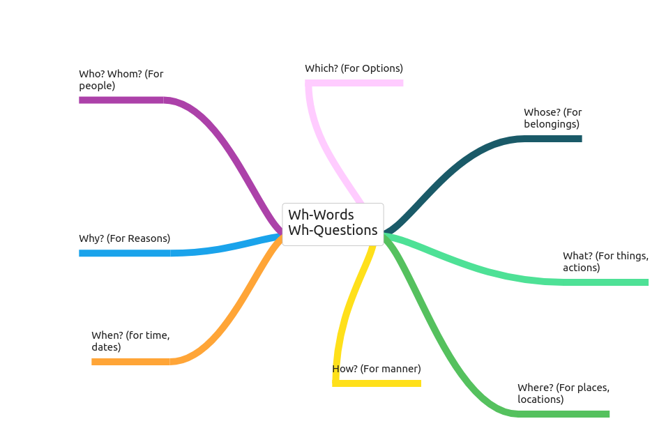

# Class 3
___Greetings___

> * Greetings
> * Introduce yourself or someone else
> * Personal questions
> * Pronouns and Verb to be
> * Wh- words/questions
> * Countries and nationalities
> * Professions

```
- Greetings -
+ Hello! + Hi!
+ What's up/new?
+ Good morning/afternoon/night/evening
+ Nice to meet you!
+ See you later!
+ Have a good day!
+ Pleased to meet you!
```

| Pronouns | Verb to be | Possitive | Negative | Question |
| ----- | ----- | ----- | ----- | -----|
| I | am | I am/ I'm | I am not | am i?
| You | are | You are / You're | You are not / You aren't | are you?
| He/She/It | is | He is / She is / It is | He isn't / She isn't / It isn't | is he? / is she? / is it?
| We/You/they | are | We are / You are / They are | We aren't / You aren't / They aren't | are we? / are you? / are they?

# Wh-Words / Wh-Questions


> # Questions and answer
> * **what** are you doing here?
> * R=
> * **where** can i found the key?
> * R=
> * **when** can i play with this?
> * R=
> * **why** do you do that?
> * R=
> * **who** is the NPC that can send me the mission?
> * R=
> * **which** is the most hard, the metal or the steel?
> * R=
> * **whose** is this item?
> * R=